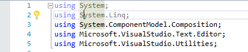
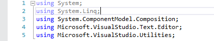

# Hide Lightbulb Margin
A Visual Studio 2015/2017/2019 addon that hides the editor margin that shows the "lightbulb" icon which reminds me of clippy.

## Screenshots
### Before

### After

You can still use the the "lightbulb" icon if you hover over the text.

## Visual Studio Marketplace
https://marketplace.visualstudio.com/vsgallery/1849bd33-d360-40b9-ad37-9d7004f43568
